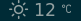

# i3-blocks weather script

Simple script which uses the [Wttr.in Api](https://github.com/chubin/wttr.in) to display location based weather information in [i3blocks](https://github.com/vivien/i3blocks).


If a location is not provided via the command line, the script will
automatically locate you using your IP address. This obviously doesn't work if you use a VPN. In that case, you must specify your location on the command line.

Location data is provided by [IP-API.com](http://ip-api.com) (it works better than Wttr default). They automatically ban any IP address that exceeds 150 requests per minute.

# Appearance
 
       

# Dependencies

* `python3.7`
* [`requests`](https://github.com/psf/requests) 
* [`Weather Icons`](http://erikflowers.github.io/weather-icons/)

# Config

```
# Current weather
#
# The script may be called with -s (for short input), -f (for input in farenheit) and -c (to specify city) switches,
# see the script for details.
[weather]
command=$SCRIPT_DIR/weather.py 
interval=3600
```


